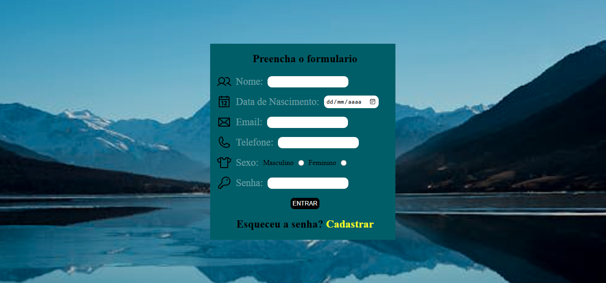

# Projeto Formulário de Cadastro

Este projeto consiste em um formulário de cadastro simples, desenvolvido com HTML e CSS. O formulário inclui campos para nome, data de nascimento, e-mail, telefone, sexo e senha. O projeto também inclui um design responsivo para dispositivos móveis.

## Descrição

O projeto foi criado para demonstrar um formulário básico de cadastro, com validações simples de campos e design responsivo. Ele pode ser usado como ponto de partida para projetos mais complexos que necessitem de formulários de cadastro.

## Funcionalidades

* Formulário de cadastro com campos para nome, data de nascimento, e-mail, telefone, sexo e senha.
* Design responsivo para dispositivos móveis.
* Botão de envio.
* Link para cadastro caso tenha esquecido a senha.
* Ícones SVG para cada input.

## Tecnologias Utilizadas

* HTML5
* CSS3
